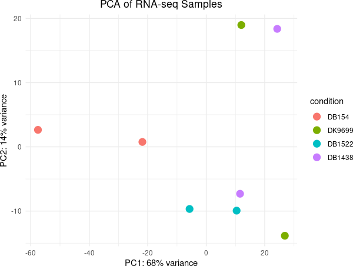
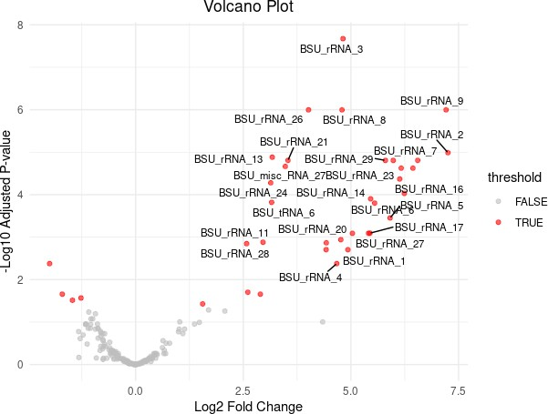
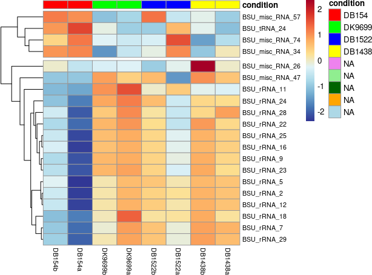

# RNA-Seq-Plasmodium-Transcriptome-Analysis
End-to-end NGS pipeline including whole genome sequencing, alignment, variant calling, and visualization using PCA and volcano plots

# NGS-Based Whole Genome and Transcriptome Analysis Pipeline

## 🚀 Project Highlights
- Performed Whole Genome Sequencing (WGS) analysis using NGS data
- Conducted quality control and preprocessing of raw reads
- Performed genome alignment and variant calling
- Generated PCA plots and volcano plots for data visualization
- Identified genetic variations and differential expression patterns

## 🧬 Overview
This project focuses on an end-to-end Next-Generation Sequencing (NGS) workflow integrating Whole Genome Sequencing (WGS) and RNA-Seq analysis. The pipeline includes data preprocessing, alignment, variant calling, and visualization of gene expression patterns.

## 🧪 Tools Used
- FastQC
- Trimmomatic
- BWA
- SAMtools
- BCFtools
- VCFtools
- R (for PCA & Volcano Plot)

## ⚙️ Workflow

### 1. Data Retrieval
- Downloaded FASTQ files from NCBI SRA database

### 2. Quality Control
fastqc sample.fastq

### 3. Read Trimming
trimmomatic PE sample_1.fastq sample_2.fastq \
trimmed_1P.fastq trimmed_1U.fastq \
trimmed_2P.fastq trimmed_2U.fastq \
SLIDINGWINDOW:4:20 MINLEN:50

### 4. Genome Alignment
bwa index reference.fasta
bwa mem reference.fasta sample_1.fastq sample_2.fastq > out.sam

samtools view -S -b out.sam > out.bam
samtools sort out.bam -o out_sorted.bam
samtools index out_sorted.bam

### 5. Variant Calling
samtools mpileup -f reference.fasta out_sorted.bam > out.pileup

bcftools mpileup -f reference.fasta out_sorted.bam | \
bcftools call -mv -Oz -o variants.vcf.gz

vcftools --gzvcf variants.vcf.gz --minQ 30 --recode --out filtered

### 6. Visualization
- Generated PCA plots using R
- Created volcano plots to identify differentially expressed genes

## 📊 Visualization

### PCA Plot

### Volcano Plot

### R Plot

## 📊 Results
- High-quality reads obtained after trimming
- Successful alignment of reads to reference genome
- Identification of genetic variants using variant calling pipeline
- PCA plots showed clustering of samples
- Volcano plots highlighted significantly expressed genes

## 🧠 Key Findings
- Identified multiple genetic variations through WGS analysis
- Visualization revealed distinct gene expression patterns
- PCA and volcano plots helped in identifying significant biological insights

## 📌 Conclusion
This project demonstrates a complete NGS pipeline from raw data processing to variant identification and data visualization, providing insights into genomic variation and gene expression.

## Author
Harini R
